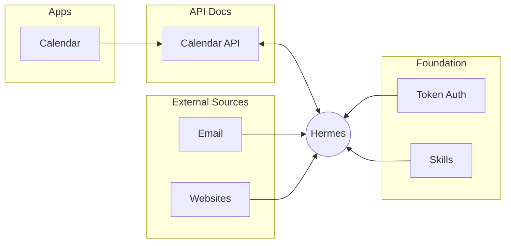
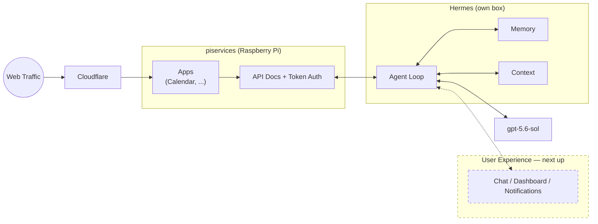
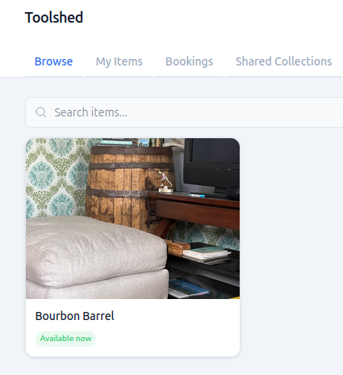
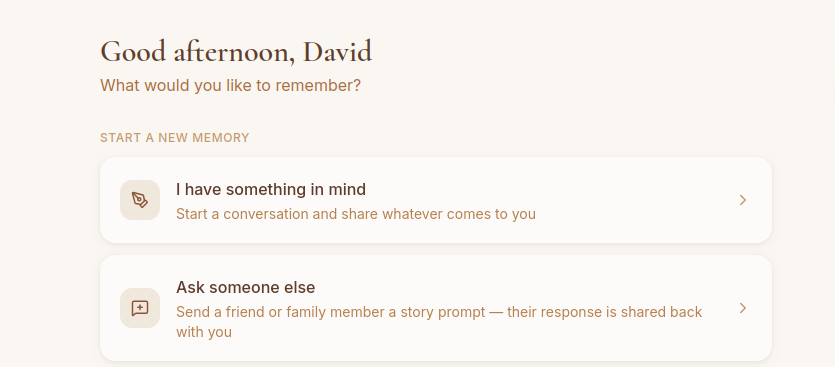

# Hi, I'm David

*Building personal tools that work well with AI agents to help improve our crazy lives*

---

## What I'm Working On

Recent projects include my own calendar app that Hermes works with:

| Project | Description |
|---------|-------------|
| [Calendar App](https://github.com/damont/calendarapp) | Family weekend planning with sports schedules and configurable child groups |
| [Golden Incubator](https://github.com/damont/golden-incubator) | AI-powered collaborative requirements gathering — chat + live doc, split-screen |
| [Daily Paper](https://github.com/damont/dailypaper) | Personal newspaper app with old-timey aesthetic, powered by AI agents |

I'm also developing app templates for spinning up projects quickly with simple auth, agent-friendly integration, solid backend data models, and mediocre UIs - [See my skill for building quick container apps here](https://github.com/damont/buildnew).

One pattern I'm excited about: giving users a token that authorizes their agent directly, then exposing API docs so agents can figure out how to interact with the tools on their own — no MCP needed. 

Each app exposes its API docs directly, so an AI agent like Hermes can read them and interact with the app using just a user token — no MCP server or custom integration required. Because agents already have access to email, websites, and other external services, your custom apps plug right into that same ecosystem.

---

## How Hermes Is Set Up

Hermes runs on its own box. To the left it reaches the **piservices** Raspberry Pi, which hosts the apps and their API docs — public web traffic gets to that Pi through Cloudflare. Inside Hermes live the memory, the context, and the agent loop, with `gpt-5.6-sol` as the LLM behind it. To the right is what I'm building next: an actual user experience on top of all of it.

---

## Current Passion Projects

### [YourToolshed](https://yourtoolshed.com)
> Stop buying things you only use once. Borrow from friends, lend what you have.

 

### [Recall](https://sharedrecall.com)
> The stories your family would lose otherwise. Talk through a memory and Recall interviews you, writes it down, and keeps it.

 

Instead of staring at a blank text box, you have a conversation — a capture agent asks follow-up questions until the memory is actually worth keeping, then saves it. Behind the scenes other agents tag each memory and build out a family tree from the people and relationships you mention, so the collection organizes itself as it grows.

You can also send someone else a story prompt. They get a link, answer in their own conversation, and the memory comes back to you — which turns out to be the easiest way to get stories out of the people least likely to sit down and write them.

You choose what to share and with whom: a share grant exposes a filtered slice of your memories to another person, and they can ask questions answered only from what you've shared with them.

## Experience

**Director of Software Engineering** — Sonic Automotive *(9 years)*
> My team focuses on improving and automating operational decision making. I started there as a Python developer and we've worked across numerous stacks and infrastructure — on-prem, Azure, and now AWS.

**Software Engineer** — Schweitzer Engineering Laboratories
> C/C++ development for a couple of years.

**B.S. Computer Engineering** — University of North Carolina at Charlotte

**B.S. Chemistry** — Clemson University (a very long time ago)
