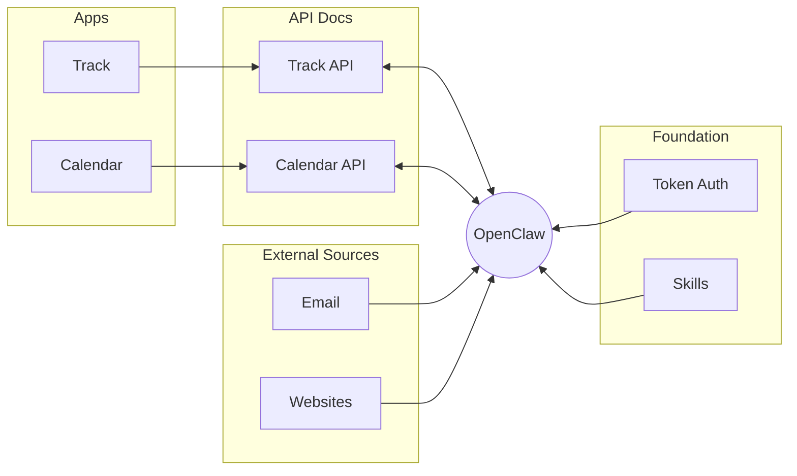
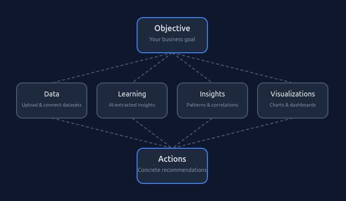

# Hi, I'm David

*Building personal tools that work well with AI agents to help improve our crazy lives*

---

## What I'm Working On

Recent projects include my own calendar and task app that OpenClaw works with:

| Project | Description |
|---------|-------------|
| [Track](https://github.com/damont/track) | A full-stack task and notes app |
| [Calendar App](https://github.com/damont/calendarapp) | Family weekend planning with sports schedules and configurable child groups |

I'm also developing app templates for spinning up projects quickly with simple auth, agent-friendly integration, solid backend data models, and mediocre UIs - [See my skill for building quick container apps here](https://github.com/damont/buildnew).

One pattern I'm excited about: giving users a token that authorizes their agent directly, then exposing API docs so agents can figure out how to interact with the tools on their own — no MCP needed. 

Each app exposes its API docs directly, so an AI agent like OpenClaw can read them and interact with the app using just a user token — no MCP server or custom integration required. Because agents already have access to email, websites, and other external services, your custom apps plug right into that same ecosystem.

---

## Current Passion Projects

### [YourToolshed](https://yourtoolshed.com)
> Stop buying things you only use once. Borrow from friends, lend what you have.

 

### [RabidOps](https://rabidops.com)
> Turn business objectives into data-driven actions. Define your goals, let AI analyze your data, extract insights, and generate actionable recommendations.

## Experience

**Director of Software Engineering** — Sonic Automotive *(9 years)*
> My team focuses on improving and automating operational decision making. I started there as a Python developer and we've worked across numerous stacks and infrastructure — on-prem, Azure, and now AWS.

**Software Engineer** — Schweitzer Engineering Laboratories
> C/C++ development for a couple of years.

**B.S. Computer Engineering** — University of North Carolina at Charlotte

**B.S. Chemistry** — Clemson University (a very long time ago)
